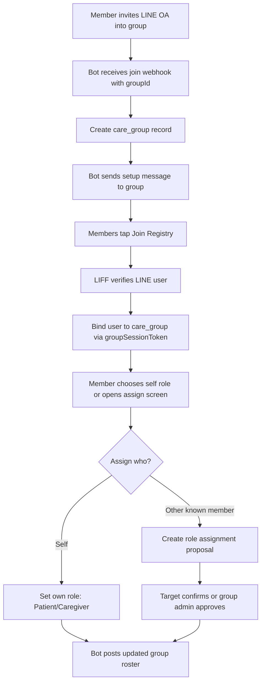

# Group-Based Register Flow for LINE Official Account

## Concept

ให้ผู้ใช้ invite LINE Official Account เข้า LINE Group แล้วให้กลุ่มนั้นกลายเป็น care circle หนึ่งวง สมาชิกในกลุ่มสามารถลงทะเบียนตัวเอง หรือ assign role ให้สมาชิกคนอื่นว่าเป็น `Patient` หรือ `Caregiver` ได้

แนวคิดหลัก:

- LINE Group = care circle / household / ward group
- LINE OA = bot ประจำกลุ่ม
- Member = LINE user ใน group
- Role = `Patient`, `Caregiver`, หรือ `Unassigned`
- Patient 1 คนมี Caregiver ได้หลายคน
- Caregiver 1 คนดูแล Patient ได้หลายคนใน group เดียวกัน

## LINE Platform Constraints

- ต้องเปิด `Allow bot to join group chats` ใน LINE Developers Console ก่อน bot จะถูก invite เข้า group ได้
- ใน group/multi-person chat มี LINE Official Account ได้ครั้งละ 1 account
- Bot จะได้ `groupId` จาก webhook event ที่เกิดใน group
- LIFF `getContext()` บอกได้ว่าเปิดจาก group แต่ไม่ให้ `groupId` แล้ว จึงต้องใช้ token/link ที่ bot สร้างจาก webhook เป็นตัวผูก LIFF กับ group
- API ดึงรายชื่อ member ทั้งกลุ่มใช้ได้เฉพาะ verified/premium account แต่ยังเก็บ user id ได้จาก webhook เมื่อสมาชิกส่งข้อความ, join group, หรือกด postback

## Recommended UX

ใช้ hybrid ระหว่าง group chat และ LIFF:

- ใน group chat ใช้ Flex Message สำหรับคำสั่งหลัก
- ใช้ LIFF สำหรับหน้าจอที่ต้องเลือกคน/แก้ไขข้อมูลหลายช่อง
- ถ้ารายชื่อสมาชิกยังไม่ครบ ให้ bot ชวนทุกคนกด `เข้าร่วมทะเบียนกลุ่ม`

## High-Level Flow



## Group Setup Flow

### 1. Invite Bot to Group

เมื่อ bot ถูก invite เข้า group:

1. Webhook `join` event ส่ง `source.type = group` และ `source.groupId`
2. Backend สร้าง `care_groups` จาก `groupId`
3. Backend เรียก group summary เพื่อเก็บชื่อ group ถ้ามี permission
4. Bot ส่ง welcome Flex Message ใน group

ข้อความแนะนำ:

> สวัสดีค่ะ กลุ่มนี้สามารถใช้ลงทะเบียนผู้ดูแลและผู้ป่วยร่วมกันได้  
> กรุณาให้สมาชิกในกลุ่มกดเข้าร่วมทะเบียนก่อน แล้วค่อย assign role

Buttons:

- `เข้าร่วมทะเบียนกลุ่ม`
- `ดูรายชื่อและ role`
- `เริ่ม assign role`

### 2. Join Registry

เมื่อสมาชิกกด `เข้าร่วมทะเบียนกลุ่ม`:

1. Bot สร้าง `groupSessionToken` ที่ผูกกับ `groupId`
2. เปิด LIFF URL เช่น `/group-register?token={groupSessionToken}`
3. LIFF login แล้วส่ง `idToken` + `groupSessionToken` ไป backend
4. Backend verify LINE identity และ bind `lineUserId` เข้ากับ care group
5. User เลือก display name ที่จะใช้ในกลุ่ม หรือใช้ LINE display name

ผลลัพธ์:

- สมาชิกคนนั้นปรากฏใน roster
- role เริ่มต้นเป็น `Unassigned`

## Role Assignment Flow

### Option A: Self-Assign

เหมาะกับ POC และลดความเสี่ยงเรื่อง assign ผิดคน

Flow:

1. User กด `ฉันคือ...`
2. เลือก `Patient` หรือ `Caregiver`
3. ถ้าเลือก `Patient` ให้กรอก profile พื้นฐาน
4. ถ้าเลือก `Caregiver` ให้กรอกความสัมพันธ์/เบอร์โทร optional
5. Bot ส่ง summary ใน group

ตัวอย่าง summary:

> อัปเดต role แล้ว  
> เมย์: Caregiver  
> คุณยายสมศรี: Patient

### Option B: Assign Other Member

เหมาะกับ requirement ที่ว่า “คนในกลุ่มสามารถ assign role ว่าใครเป็น Patient หรือ Caregiver ก็ได้”

Flow:

1. User เปิด LIFF `เริ่ม assign role`
2. เลือกสมาชิกจาก roster ที่ bot รู้จักแล้ว
3. เลือก role: `Patient` หรือ `Caregiver`
4. กรอกรายละเอียด role
5. สร้าง `role_assignment` เป็นสถานะ `pending`
6. Bot แจ้งใน group ให้ target confirm

ตัวอย่าง:

> เมย์เสนอให้ “คุณยายสมศรี” เป็น Patient ของกลุ่มนี้  
> กรุณาให้คุณยายสมศรีกดยืนยัน หรือให้ admin กลุ่มอนุมัติ

Buttons:

- `ยืนยัน role`
- `ปฏิเสธ`
- `แก้ไข`

สำหรับ POC แนะนำให้มี confirmation อย่างน้อย 1 แบบ:

- Target user กดยืนยันเอง
- หรือ group admin / creator ของ care group กดยืนยันแทน

### Option C: Assign Non-LINE Patient

จำเป็นมากสำหรับผู้สูงอายุที่อาจไม่ได้ใช้ LINE

Flow:

1. Caregiver กด `เพิ่ม Patient ที่ไม่ได้อยู่ใน LINE`
2. กรอกข้อมูล patient profile
3. Patient ถูกสร้างเป็น record แบบไม่มี `lineUserId`
4. Caregiver ที่สร้างเป็น primary caregiver
5. คนอื่นใน group สามารถถูก assign เป็น caregiver เพิ่มได้

นี่ควรอยู่ใน POC ด้วย เพราะ case ผู้สูงอายุไม่มี LINE เจอบ่อย

## Role Rules

Role ในกลุ่ม:

- `Patient`: คนที่รับการดูแล
- `Caregiver`: คนดูแล
- `Coordinator`: คนจัดการกลุ่ม/อนุมัติ assignment
- `Unassigned`: สมาชิกที่เข้าร่วมทะเบียนแล้ว แต่ยังไม่มี role

Permission:

```text
Coordinator
  - assign role ให้ทุกคน
  - approve/reject pending assignment
  - แก้ไข profile patient
  - invite/remove caregiver relation

Caregiver
  - self-assign เป็น caregiver
  - propose role assignment ให้คนอื่น
  - เพิ่ม patient ที่ไม่ได้อยู่ใน LINE
  - ดูข้อมูล patient ใน group

Patient
  - ดูข้อมูลของตัวเอง
  - confirm/reject ว่าตัวเองเป็น patient

Unassigned
  - join registry
  - self-assign
  - propose assignment แบบจำกัด
```

สำหรับ POC ถ้ายังไม่ทำ permission เต็ม ให้ใช้ rule นี้:

- คนแรกที่กด `เข้าร่วมทะเบียนกลุ่ม` เป็น `Coordinator`
- ทุกคน assign role ได้ แต่ role ที่ assign ให้คนอื่นต้อง `pending`
- self-assign อนุมัติทันที

## Patient Profile Fields

Fields ขั้นต่ำ:

- ชื่อ
- นามสกุล
- ชื่อเล่น
- เพศ
- อายุหรือวันเกิด
- ส่วนสูง
- น้ำหนัก
- โรคประจำตัว

Fields แนะนำ:

- ยาประจำ
- แพ้ยา/แพ้อาหาร
- หมายเหตุฉุกเฉิน
- โรงพยาบาลประจำ

## Caregiver Profile Fields

Fields ขั้นต่ำ:

- ชื่อ
- นามสกุล
- เบอร์โทรศัพท์
- ความสัมพันธ์กับ patient

Fields แนะนำ:

- พร้อมรับแจ้งเตือนหรือไม่
- ช่วงเวลาที่สะดวก
- เป็น caregiver หลักหรือไม่

## Group Dashboard in LIFF

หน้า dashboard ควรมี 3 tabs:

1. `Members`
   - รายชื่อสมาชิกที่เข้าร่วมทะเบียน
   - role ปัจจุบัน
   - status: pending/confirmed

2. `Patients`
   - Patient cards
   - Caregiver ที่ผูกอยู่กับแต่ละ patient
   - ปุ่ม assign caregiver

3. `Pending`
   - role assignments รออนุมัติ
   - confirm/reject/edit

## State Machine

```text
GROUP_CREATED
  -> WAITING_FOR_MEMBERS
  -> ROLE_ASSIGNMENT_OPEN
  -> HAS_PATIENTS_AND_CAREGIVERS

MEMBER_DISCOVERED
  -> MEMBER_JOINED_REGISTRY
  -> ROLE_UNASSIGNED
  -> ROLE_PENDING
  -> ROLE_CONFIRMED
  -> ROLE_REJECTED
```

## Data Model

```sql
line_users (
  id uuid primary key,
  line_user_id text unique not null,
  display_name text,
  picture_url text,
  created_at timestamp not null,
  updated_at timestamp not null
);

care_groups (
  id uuid primary key,
  line_group_id text unique not null,
  group_name text,
  created_by_user_id uuid references line_users(id),
  status text not null default 'active',
  created_at timestamp not null,
  updated_at timestamp not null
);

group_members (
  id uuid primary key,
  group_id uuid references care_groups(id),
  user_id uuid references line_users(id),
  display_name_in_group text,
  group_role text not null default 'unassigned',
  role_status text not null default 'unassigned',
  is_coordinator boolean not null default false,
  joined_registry_at timestamp,
  created_at timestamp not null,
  updated_at timestamp not null,
  unique (group_id, user_id)
);

patients (
  id uuid primary key,
  group_id uuid references care_groups(id),
  line_user_id uuid references line_users(id),
  first_name text not null,
  last_name text,
  nickname text,
  gender text,
  birth_date date,
  height_cm numeric,
  weight_kg numeric,
  chronic_diseases jsonb not null default '[]',
  medications jsonb not null default '[]',
  allergies jsonb not null default '[]',
  emergency_note text,
  created_by_member_id uuid references group_members(id),
  role_status text not null default 'confirmed',
  created_at timestamp not null,
  updated_at timestamp not null
);

caregivers (
  id uuid primary key,
  group_id uuid references care_groups(id),
  line_user_id uuid references line_users(id) not null,
  first_name text,
  last_name text,
  phone text,
  created_by_member_id uuid references group_members(id),
  role_status text not null default 'confirmed',
  created_at timestamp not null,
  updated_at timestamp not null,
  unique (group_id, line_user_id)
);

patient_caregivers (
  patient_id uuid references patients(id),
  caregiver_id uuid references caregivers(id),
  relationship text,
  is_primary boolean not null default false,
  status text not null default 'active',
  created_at timestamp not null,
  primary key (patient_id, caregiver_id)
);

role_assignments (
  id uuid primary key,
  group_id uuid references care_groups(id),
  target_user_id uuid references line_users(id),
  target_patient_id uuid references patients(id),
  proposed_role text not null,
  proposed_by_member_id uuid references group_members(id),
  status text not null default 'pending',
  payload jsonb not null default '{}',
  approved_by_member_id uuid references group_members(id),
  approved_at timestamp,
  rejected_at timestamp,
  created_at timestamp not null,
  updated_at timestamp not null
);

group_session_tokens (
  id uuid primary key,
  group_id uuid references care_groups(id),
  token_hash text unique not null,
  purpose text not null,
  expires_at timestamp not null,
  created_at timestamp not null
);
```

## API Contract

```text
POST /api/line/webhook
  - verify LINE signature
  - handle group join/member join/message/postback
  - create/update care group and known members

POST /api/line/group-session
  - internal endpoint or service function
  - create short-lived LIFF token bound to groupId

POST /api/auth/line/verify-group-token
  body: { idToken, groupSessionToken }
  result: { user, group, member }

GET /api/groups/:groupId/dashboard
  result: members, patients, caregivers, pending assignments

POST /api/groups/:groupId/members/self-role
  body: { role, profile }

POST /api/groups/:groupId/role-assignments
  body: { targetUserId | targetPatientId, proposedRole, payload }

POST /api/role-assignments/:assignmentId/approve

POST /api/role-assignments/:assignmentId/reject

POST /api/groups/:groupId/patients/non-line
  body: patient profile
```

## Group Commands

รองรับทั้งปุ่มและ keyword:

```text
ลงทะเบียน
  -> ส่ง Join Registry LIFF link

รายชื่อ
  -> ส่ง roster summary

assign
  -> ส่ง LIFF link ไปหน้า assign role

เพิ่ม patient
  -> ส่ง LIFF link ไปหน้าเพิ่ม patient ที่ไม่ได้อยู่ใน LINE

ช่วยเหลือ
  -> ส่งเมนูคำสั่ง
```

## Flex Message Copy

### Bot Joined Group

Title: `เริ่มทะเบียนกลุ่มดูแล`

Body: `ให้สมาชิกกดเข้าร่วมทะเบียนก่อน แล้วเลือกหรือมอบ role ว่าใครเป็น Patient / Caregiver`

Buttons:

- `เข้าร่วมทะเบียนกลุ่ม`
- `เริ่ม assign role`
- `ดูรายชื่อ`

### Roster Summary

Title: `รายชื่อในกลุ่ม`

Body:

```text
Patient
- คุณยายสมศรี

Caregiver
- เมย์
- ตาล

ยังไม่ระบุ role
- บอล
```

Buttons:

- `แก้ไข role`
- `เพิ่ม Patient`

### Pending Assignment

Title: `รอยืนยัน role`

Body: `{proposerName} เสนอให้ {targetName} เป็น {role}`

Buttons:

- `ยืนยัน`
- `ปฏิเสธ`
- `เปิดรายละเอียด`

## POC Scope

ทำให้จบก่อน:

- Bot ถูก invite เข้า group แล้วสร้าง care group ได้
- Bot ส่ง setup Flex Message ใน group
- สมาชิกกด LIFF link แล้ว join registry ได้
- คนแรกเป็น Coordinator
- Self-assign เป็น Patient/Caregiver ได้
- Assign role ให้ member ที่เคย join registry แล้วได้ โดยสถานะเป็น pending
- Confirm/reject assignment ได้
- เพิ่ม Patient ที่ไม่ได้อยู่ใน LINE ได้
- ดู roster summary ใน group ได้

เลื่อนไป phase ถัดไป:

- ดึง member list ทั้ง group สำหรับ verified/premium account
- Fine-grained permission
- Audit log
- Reminder/medication workflow
- Export care summary

## Implementation Notes

- Webhook ต้อง verify signature ทุกครั้ง
- เก็บ `webhookEventId` เพื่อกัน duplicate
- `groupSessionToken` ควร short-lived และ hash ก่อนเก็บใน database
- อย่าพึ่งพา LIFF context สำหรับ `groupId`; ให้ใช้ token ที่สร้างจาก webhook
- ถ้า user เปิด LIFF จาก external browser ต้อง handle login แล้ว bind ด้วย token เหมือนเดิม
- การ assign role ให้คนอื่นควรมี confirmation หรือ coordinator approval เพื่อป้องกันข้อมูลสุขภาพผิดคน
